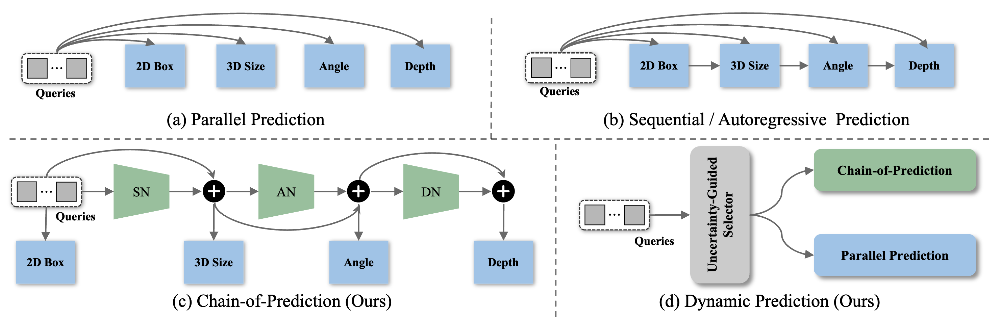
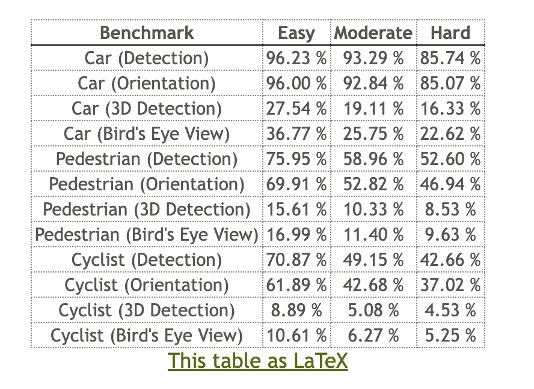

<div align="center">
<h1>Unleashing the Power of Chain-of-Prediction for Monocular 3D Object Detection</h1>

<a href="https://arxiv.org/abs/2503.11651"></a>
<a href="https://alanzhangcs.github.io/monocop-page/"></a>
<a href="https://huggingface.co/zhihao406/MonoCoP/tree/main"></a>
<a href="LICENSE"></a>

**[Michigan State University](https://cvlab.cse.msu.edu/) &nbsp;|&nbsp; [University of North Carolina at Chapel Hill](https://cs.unc.edu/)**

[Zhihao Zhang](https://alanzhangcs.github.io/), [Abhinav Kumar](https://sites.google.com/view/abhinavkumar), [Girish Chandar Ganesan](https://girish1511.github.io/), [Xiaoming Liu](https://www.cse.msu.edu/~liuxm/index2.html)

[CVPR 2026](https://cvpr.thecvf.com/Conferences/2026/)

</div>

<p align="center">
  
</p>

```bibtex
@inproceedings{zhang2025unleashing,
  title={Unleashing the Power of Chain-of-Prediction for Monocular 3D Object Detection},
  author={Zhang, Zhihao and Kumar, Abhinav and Ganesan, Girish Chandar and Liu, Xiaoming},
  booktitle={Proceedings of the IEEE/CVF Conference on Computer Vision and Pattern Recognition},
  year={2026}
}
```

---

## TL;DR

MonoCoP is a monocular 3D object detection framework that adaptively exploits inter-attribute correlations (depth, size, orientation) via a **Chain-of-Prediction (CoP)** module and an **Uncertainty-Guided Selector (UGS)**. It achieves state-of-the-art results on KITTI, nuScenes, and Waymo.

---

## Table of Contents
- [Abstract](#abstract)
- [Updates](#updates)
- [Checklist](#checklist)
- [Installation](#installation)
- [Training & Evaluation](#training--evaluation)
- [Model Zoo](#model-zoo)
- [Acknowledgements](#acknowledgements)
- [License](#license)


## Abstract

Monocular 3D detection (Mono3D) aims to infer 3D bounding boxes from a single RGB image. Without auxiliary sensors such as LiDAR, this task is inherently ill-posed since the 3D-to-2D projection introduces depth ambiguity. Previous works often predict 3D attributes (e.g., depth, size, and orientation) in parallel, overlooking that these attributes are inherently correlated through the 3D-to-2D projection. However, simply enforcing such correlations through sequential prediction can propagate errors across attributes, especially when objects are occluded or truncated, where inaccurate size or orientation predictions can further amplify depth errors. Therefore, neither parallel nor sequential prediction is optimal. In this paper, we propose **MonoCoP**, an adaptive framework that learns *when* and *how* to leverage inter-attribute correlations with two complementary designs. A Chain-of-Prediction (CoP) explores inter-attribute correlations through feature-level learning, propagation, and aggregation, while an Uncertainty-Guided Selector (UGS) dynamically switches between CoP and parallel paradigms for each object based on the predicted uncertainty. By combining their strengths, MonoCoP achieves state-of-the-art (SOTA) performance on KITTI, nuScenes, and Waymo, significantly improving depth accuracy, particularly for distant and challenging objects.


## Updates
- **[Mar 28, 2026]** Released pretrained models and checkpoints.
- **[Mar 27, 2026]** Released official code and training logs.
- **[Feb 12, 2026]** MonoCoP accepted at **CVPR 2026**.

## Checklist

- [x] Code release
- [x] Pretrained models
- [x] Training logs
- [ ] nuScenes and Waymo dataset configs


## Installation

**1. Clone the repository and create the conda environment:**
```bash
git clone git@github.com:alanzhangcs/MonoCoP.git
cd MonoCoP

conda create -n monocop python=3.9
conda activate monocop
```

**2. Install PyTorch and torchvision (CUDA 12.1):**
```bash
conda install pytorch==2.4.1 torchvision==0.19.1 torchaudio==2.4.1 pytorch-cuda=12.1 -c pytorch -c nvidia
```

**3. Install requirements and compile deformable attention:**
```bash
pip install -r requirements.txt

cd lib/models/monocop/ops/
bash make.sh
cd ../../../..
```

**4. Prepare the KITTI dataset** under `data/KITTIDataset/` (matching `dataset.root_dir` in the config):
```
MonoCoP/
├── config/
├── data/
│   └── KITTIDataset/
│       ├── ImageSets/
│       ├── training/
│       │   ├── image_2/
│       │   ├── label_2/
│       │   └── calib/
│       └── testing/
│           ├── image_2/
│           └── calib/
```


## Training & Evaluation

**Training** (single GPU):
```bash
bash train.sh 0 --config config/monocop.yaml
```

**Evaluation only:**
```bash
bash test.sh 0 --config config/monocop_test.yaml
```

**Quick evaluation with a pretrained checkpoint** (set `trainer.pretrain_model` in the config to the downloaded checkpoint path, then run evaluation as above):
```yaml
# in config/monocop_test.yaml
trainer:
  pretrain_model: /path/to/checkpoint.pth
```

By default, logs and checkpoints are saved under `outputs/.../` (see `trainer.save_path` in the config).


## Model Zoo

Pretrained checkpoints and training logs are available for download via the links below.

### KITTI Val Set

| Setting | Config | AP3D Car (E/M/H) | Checkpoint | Training log |
|:---:|:---:|:---:|:---:|:---:|
| KITTI (Car/Ped/Cyc) | `config/monocop.yaml` | 23.72 | [Model](https://huggingface.co/zhihao406/MonoCoP/tree/main) | [Log](assets/train1.log) |
| KITTI (Car) | `config/monocop_car.yaml` | 24.05 | [Model](https://huggingface.co/zhihao406/MonoCoP/tree/main) | [Log](assets/train.log) |

### KITTI Test Leaderboard

| Setting | AP3D Car (Mod.) | KITTI Leaderboard | Checkpoint |
|:---:|:---:|:---:|:---:|
| KITTI | 19.11 | [Link](https://www.cvlibs.net/datasets/kitti/eval_object.php?obj_benchmark=3d) | [Model](https://huggingface.co/zhihao406/MonoCoP/tree/main) |

<p align="center">
  
</p>


## Acknowledgements

This project builds upon and adapts components from several excellent open-source works:
[DEVIANT](https://github.com/abhi1kumar/DEVIANT),
[MonoDETR](https://github.com/ZrrSkywalker/MonoDETR),
[MonoDGP](https://github.com/PuFanqi23/MonoDGP),
[DETR](https://github.com/facebookresearch/detr), and
[Deformable DETR](https://github.com/fundamentalvision/Deformable-DETR).
We thank the authors for making their code publicly available.

## License

This project is licensed under the MIT License. See [`LICENSE`](LICENSE) for details.
